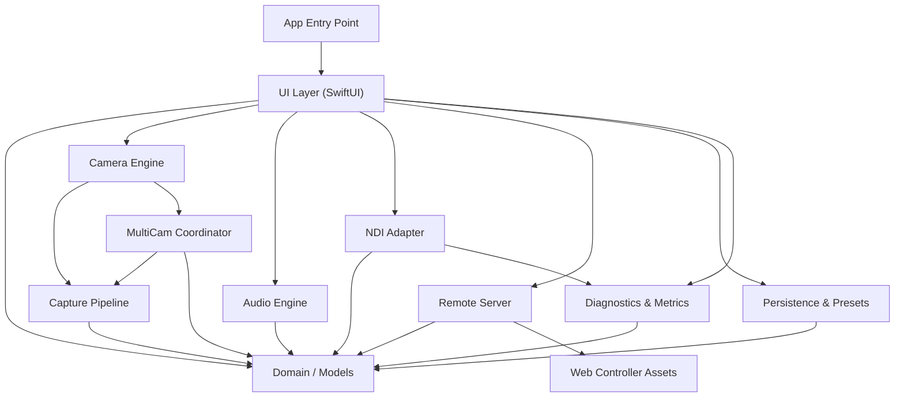

# TamaNDI — System Architecture

> **Status**: Design Phase — No implementation exists yet.
> **Date**: 2026-08-28
> **Author**: Principal Engineer (Automated)

---

## 1. Architecture Overview

TamaNDI follows a **modular, protocol-oriented, actor-isolated** architecture.
The system is organized into 11 distinct layers with explicit dependency
directions. No module may reach upward in the dependency graph.



---

## 2. Layer Definitions

### 2.1 App Layer
- **Responsibility**: Application entry point (`@main`), dependency injection container, app lifecycle management.
- **Files**: `TamaNDIApp.swift`, `DependencyContainer.swift`
- **Owns**: Root `WindowGroup`, permission flow orchestration.

### 2.2 Domain / Models Layer
- **Responsibility**: Pure value types shared across all modules. No framework imports beyond Foundation.
- **Contents**:
  - `CameraDevice` — lens position, unique ID, human-friendly name
  - `CaptureFormat` — resolution, FPS ranges, pixel format, stabilization modes
  - `CameraMode` — `.single`, `.dualIndependent`, `.dualComposite`, `.tripleIndependent`, `.tripleComposite`
  - `StreamState` — `.idle`, `.starting`, `.streaming`, `.stopping`, `.error`
  - `AudioRoute` — input name, channel count, sample rate
  - `Orientation` — `.auto`, `.portrait`, `.landscapeLeft`, `.landscapeRight`
  - `DisplayMode` — `.normal`, `.dimmed`, `.blacked`
  - `Preset` — named configuration bundle with capability guards
  - `NDIConfiguration` — source name, group, format preferences
  - `NDIStatistics` — frames sent, dropped, queue depth, latency
  - `Capability` — dynamic capability flags for the current device
  - `DiagnosticsSnapshot` — point-in-time system metrics
  - `PairingToken` — opaque bearer token with expiry
  - `RemoteCommand` — typed enum of all API commands
  - `FeatureFlags` — compile-time and runtime feature toggles

### 2.3 Camera Engine Layer
- **Responsibility**: AVFoundation device discovery, format enumeration, session configuration, focus/exposure/zoom/torch control.
- **Actor**: `CameraSessionActor` — serializes all `AVCaptureSession` mutations on a dedicated dispatch queue.
- **Protocols**:
  - `CameraControlling` — lens selection, format selection, focus, exposure, zoom, torch, stabilization
  - `CameraCapabilityProviding` — enumerates available devices, formats, FPS ranges
- **Key rule**: All capabilities are **discovered dynamically** from `AVCaptureDevice.DiscoverySession`. Never hard-code lens availability, resolution, or FPS.

### 2.4 Capture Pipeline Layer
- **Responsibility**: `AVCaptureVideoDataOutput` delegate, frame delivery, pixel buffer management, timestamp preservation.
- **Data flow**: `CVPixelBuffer` flows from the capture output delegate directly to the NDI adapter. No `UIImage` conversion. No main-thread processing.
- **Protocols**:
  - `FrameReceiving` — accepts `CVPixelBuffer` + `CMTime` timestamp
- **Performance**: Uses `AVCaptureVideoDataOutput.alwaysDiscardsLateVideoFrames = true` to prevent queue stalls. Frame processing occurs on a dedicated serial queue.

### 2.5 MultiCam Coordinator Layer
- **Responsibility**: `AVCaptureMultiCamSession` management, device combination validation, resource budget tracking.
- **Guard**: Always checks `AVCaptureMultiCamSession.isMultiCamSupported` before attempting multi-camera modes.
- **Combination validation**: Uses `AVCaptureDevice.SystemPressureState` and `AVCaptureMultiCamSession` hardware cost queries to determine viable combinations at runtime.
- **Modes**:
  - Independent: Each camera feed gets its own `FrameReceiving` sink → separate NDI sources
  - Composite: Feeds are composited via Metal/CoreImage into a single output → one NDI source

### 2.6 Audio Engine Layer
- **Responsibility**: Audio route discovery, microphone selection (where iOS permits), gain/mute, sample delivery to NDI.
- **Protocols**:
  - `AudioControlling` — mute, gain, route selection
  - `AudioCapabilityProviding` — available routes, channel counts, sample rates
- **Integration**: Uses `AVCaptureAudioDataOutput` for synchronized audio timestamps with video. Falls back to `AVAudioEngine` only if justified.

### 2.7 NDI Adapter Layer
- **Responsibility**: Abstraction over the NDI SDK. All NDI interaction goes through a `NDIBackend` protocol.
- **Protocols**:
  - `NDISending` — create/destroy sender, send video frame, send audio frame, send metadata
  - `NDIBackend` — lifecycle (initialize/shutdown), sender factory, capability query
- **Implementations**:
  - `MockNDIBackend` — simulates state and metrics for development/testing. Does NOT fake encoding.
  - `RealNDIBackend` — (BLOCKED until SDK is provided) wraps actual NDI C API via Swift/C interop.
- **Backpressure**: Frame dropping policy ensures the camera pipeline never stalls waiting for network I/O. Queue depth is bounded and monitored.

### 2.8 Remote Server Layer
- **Responsibility**: LAN-local HTTP + WebSocket server for browser-based remote control.
- **Transport**: Built with `Network.framework` (`NWListener`, `NWConnection`).
- **Discovery**: Bonjour (`NWBrowser` / `NetService`) advertisement of `_tamandicam._tcp.` service.
- **Security**: Pairing code → bearer token exchange. Tokens stored only on device. All sessions revocable. Rate-limited. Bound to LAN interfaces.
- **Protocols**:
  - `RemoteControlling` — start/stop server, active sessions, revoke tokens
  - `PairingManaging` — generate pairing code, validate code, issue token

### 2.9 Web Controller Layer
- **Responsibility**: Static HTML/CSS/JS assets served by the Remote Server. Provides a broadcast-style control dashboard.
- **Tech**: Vanilla JavaScript (or TypeScript compiled to JS). No framework dependencies.
- **Communication**: REST for commands, WebSocket for real-time state updates.

### 2.10 Persistence Layer
- **Responsibility**: User preferences, presets, settings import/export.
- **Storage**: `UserDefaults` via `@AppStorage` for simple settings. JSON files for preset import/export.
- **Security**: Pairing tokens are NEVER exported. Settings export is sanitized.

### 2.11 Diagnostics Layer
- **Responsibility**: Performance monitoring, metrics collection, logging, capability inspection.
- **Tools**: `os.Logger` for structured logging. `os_signpost` for Instruments integration on critical pipeline sections.
- **Protocols**:
  - `MetricsProviding` — current FPS, dropped frames, queue depths, thermal state, memory
- **Export**: JSON diagnostics snapshot (secrets excluded).

---

## 3. Concurrency Model

| Component | Isolation Strategy | Queue/Actor |
|---|---|---|
| Camera Session | Dedicated actor | `CameraSessionActor` on serial `DispatchQueue` |
| Video Frame Delivery | Serial callback queue | `captureOutputQueue` (non-main) |
| Audio Frame Delivery | Serial callback queue | `audioOutputQueue` (non-main) |
| NDI Sending | Actor-isolated | `NDISenderActor` |
| Remote Server | Network.framework event loop | NWListener's queue |
| WebSocket Broadcast | Actor-isolated | `WebSocketBroadcastActor` |
| UI State | `@MainActor` | Main thread via `@Published` / `@Observable` |
| Diagnostics | Actor-isolated | `DiagnosticsActor` |
| Persistence | `@MainActor` or synchronous | Main thread (small writes only) |

### Rules
1. Camera callbacks (`AVCaptureVideoDataOutputSampleBufferDelegate`) MUST NOT mutate `@Published` SwiftUI state directly. They publish via an actor boundary.
2. Frame data (`CVPixelBuffer`) is passed by reference. No copies unless composition requires it.
3. All cross-module communication uses Swift Concurrency (`async/await`, `AsyncStream`).
4. `@MainActor` is used only in the UI layer and for state objects that SwiftUI observes.

---

## 4. Protocol Boundaries

```
┌──────────────────────────────────────────────────────────────────┐
│  UI Layer                                                         │
│  Observes: @Observable state objects                              │
│  Calls: CameraControlling, AudioControlling, NDISending,         │
│         RemoteControlling, MetricsProviding                      │
└──────────┬───────────────────────────────────────────────────────┘
           │ protocol boundaries
┌──────────▼───────────────────────────────────────────────────────┐
│  Camera: CameraControlling, CameraCapabilityProviding            │
│  Audio:  AudioControlling, AudioCapabilityProviding              │
│  NDI:    NDISending, NDIBackend                                  │
│  Remote: RemoteControlling, PairingManaging                      │
│  Diag:   MetricsProviding                                        │
└──────────────────────────────────────────────────────────────────┘
```

Every module boundary is a Swift protocol. This enables:
- Mock implementations for testing
- NDI backend swapping (Mock ↔ Real)
- Independent module development and compilation

---

## 5. Data Flow — Camera Frame Pipeline

```
AVCaptureDevice
  │
  ▼
AVCaptureSession / AVCaptureMultiCamSession
  │
  ├─▶ AVCaptureVideoDataOutput  ──▶  captureOutputQueue
  │     │
  │     ▼
  │   FrameReceiving.didReceive(pixelBuffer: CVPixelBuffer, timestamp: CMTime)
  │     │
  │     ├─▶ NDISenderActor.sendVideoFrame(pixelBuffer, timestamp)
  │     │     └─▶ NDIBackend (Mock or Real SDK)
  │     │
  │     └─▶ PreviewLayer (via AVCaptureVideoPreviewLayer, no copy)
  │
  └─▶ AVCaptureAudioDataOutput  ──▶  audioOutputQueue
        │
        ▼
      AudioFrameReceiving.didReceive(sampleBuffer: CMSampleBuffer)
        │
        └─▶ NDISenderActor.sendAudioFrame(sampleBuffer)
```

**Key performance constraints:**
- Zero `UIImage` conversions in the pipeline
- `CVPixelBuffer` passed by reference (no copy)
- Late frames discarded by AVFoundation (`alwaysDiscardsLateVideoFrames`)
- NDI sender has bounded queue; excess frames dropped with metric increment
- Metal used only for multi-camera composition when needed

---

## 6. Security Architecture

```
Browser ──── LAN ────▶ NWListener (bound to LAN interface)
                          │
                          ├─▶ GET /pair?code=XXXX
                          │     └─▶ Returns bearer token (if code matches)
                          │
                          ├─▶ Authenticated REST endpoints
                          │     └─▶ Bearer token in Authorization header
                          │
                          └─▶ Authenticated WebSocket
                                └─▶ Token validated on upgrade

Phone UI ──▶ Displays 6-digit pairing code
           ──▶ Stores issued tokens in Keychain
           ──▶ "Revoke All" button invalidates all tokens
```

- No public internet exposure by default
- Tokens are short-lived or revocable
- Tokens never logged or exported
- Rate limiting on all endpoints

---

## 7. iOS Lifecycle Integration

| Event | Response |
|---|---|
| App → Background | Stop preview, continue capture if possible, warn user |
| App → Foreground | Resume preview |
| AVCaptureSession interrupted | Publish interruption reason, attempt recovery |
| Media services reset | Tear down and rebuild session |
| Thermal pressure elevated | Reduce resolution/FPS, publish warning |
| Memory pressure | Reduce queue depths, publish warning |
| Audio route change | Update route info, re-configure if needed |
| Permission revoked | Stop capture, show permission UI |
