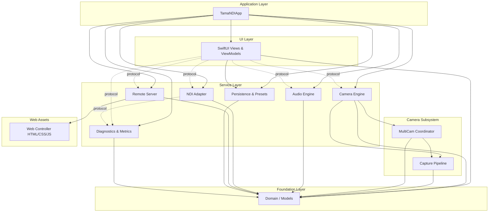

# TamaNDI — Dependency Graph

> **Status**: Design Phase
> **Date**: 2026-08-28

---

## 1. Module Dependency Matrix

The following table shows which modules depend on which. Dependencies flow **downward only** — no module may depend on a module above it in the layering.

| Module | Depends On |
|---|---|
| **App** | UI, Domain, Camera, Audio, NDI, Remote, Persistence, Diagnostics |
| **UI** | Domain, Camera (protocol), Audio (protocol), NDI (protocol), Remote (protocol), Persistence, Diagnostics (protocol) |
| **Camera** | Domain, Capture, MultiCam |
| **Capture** | Domain |
| **MultiCam** | Domain, Capture |
| **Audio** | Domain |
| **NDI** | Domain, Diagnostics (protocol) |
| **Remote** | Domain, WebController (static assets) |
| **WebController** | (standalone HTML/CSS/JS, no Swift deps) |
| **Persistence** | Domain |
| **Diagnostics** | Domain |
| **Domain** | Foundation only |

---

## 2. Dependency Graph (Visual)



> Dashed arrows (-.->|protocol|) indicate protocol-only dependencies. The UI layer never imports concrete implementations — only protocol types defined in the Domain or service layers.

---

## 3. Apple Framework Dependencies

| Module | Apple Frameworks |
|---|---|
| App | SwiftUI, UIKit (lifecycle) |
| UI | SwiftUI |
| Domain | Foundation |
| Camera | AVFoundation, CoreMedia, CoreVideo |
| Capture | AVFoundation, CoreMedia, CoreVideo |
| MultiCam | AVFoundation, CoreMedia, CoreVideo, Metal (composition only) |
| Audio | AVFoundation, AVFAudio |
| NDI | Foundation, CoreMedia, CoreVideo |
| Remote | Network.framework |
| WebController | — (static web assets) |
| Persistence | Foundation (UserDefaults, JSONEncoder/Decoder) |
| Diagnostics | os (Logger, Signpost), Foundation |

---

## 4. Third-Party Dependencies

| Dependency | Type | Status | Purpose |
|---|---|---|---|
| NDI SDK (Vizrt) | Vendored XCFramework | ❌ **NOT AVAILABLE** | NDI video/audio sending |

> **Policy**: No third-party Swift packages are required. The project uses only Apple first-party frameworks. The NDI SDK is the sole external dependency and must be obtained from Vizrt and placed in `Vendor/NDI/` by the developer.

---

## 5. Build Order

Modules must compile in this order (each depends only on previously compiled modules):

```
1. Domain            (no dependencies)
2. Diagnostics       (Domain)
3. Capture           (Domain)
4. MultiCam          (Domain, Capture)
5. Camera            (Domain, Capture, MultiCam)
6. Audio             (Domain)
7. NDI               (Domain, Diagnostics)
8. WebController     (copy static assets)
9. Remote            (Domain, WebController)
10. Persistence      (Domain)
11. UI               (Domain, protocols from all service layers)
12. App              (everything)
```

---

## 6. Protocol Dependency Contracts

The UI layer depends on these protocols, NOT concrete types:

```swift
// Camera
protocol CameraControlling: Sendable { ... }
protocol CameraCapabilityProviding: Sendable { ... }

// Audio
protocol AudioControlling: Sendable { ... }
protocol AudioCapabilityProviding: Sendable { ... }

// NDI
protocol NDISending: Sendable { ... }
protocol NDIBackend: Sendable { ... }

// Remote
protocol RemoteControlling: Sendable { ... }
protocol PairingManaging: Sendable { ... }

// Diagnostics
protocol MetricsProviding: Sendable { ... }
```

Concrete implementations are injected by the `DependencyContainer` at app launch.

---

## 7. Conditional Compilation

```swift
#if canImport(NDILib)
    // Real NDI backend
    let ndiBackend: NDIBackend = RealNDIBackend()
#else
    // Mock NDI backend for development
    let ndiBackend: NDIBackend = MockNDIBackend()
#endif
```

The app MUST compile and run in mock mode when the NDI SDK is not present. No source file should fail to compile due to a missing NDI import.
